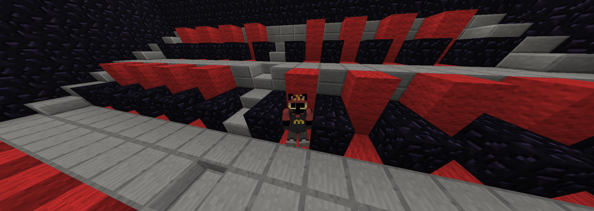

# 🪑 Seatify (ᵔ⩊ᵔ)

Seatify is a lightweight MCGalaxy plugin that lets players create, manage, and interact with seats inside the world.

It supports click-based placement, cuboid selection, ownership control, and admin tools.



---

## ✨ Features (ᵕ—ᴗ—)

- 🪑 Place seats at your position
- 🖱️ Click-to-place system
- 📦 Cuboid seat creation
- 🧹 Remove seats safely
- 👤 Owner protection system
- 🔒 Admin override support
- 📊 Seat information system
- 🧭 Teleport to seats
- ⚙️ Freeze / protection tools

---

## 📦 Commands (◠‿◠)

### 🪑 Basic Seat Commands (o_ _)ﾉ彡☆
- `/seat add` → place seat at your position  
- `/seat add click` → click block to place seat  
- `/seat remove` → remove seat at your position  
- `/seat remove click` → click seat to remove  

---

### 📦 Cuboid System (￣▽￣)
- `/seat add cuboid` → select two corners to create multiple seats  
- `/seat remove cuboid` → remove seats in selected area  

---

### ℹ️ Info & Utility (¬‿¬ )
- `/seat info` → show seat info at current position  
- `/seat tp <index>` → teleport to a seat  
- `/seatnear <radius>` → find nearby seats  
- `/myseats <page>` → view your seats  
- `/listseats [level|all]` → list seats  

---

### 🛠 Admin Tools (￣▽￣)b
- `/seatfreeze <level>` → toggle seat editing lock  
- `/seatremoveowner <player> confirm` → delete all player seats  
- `/seatremoveallmine confirm` → remove all your seats  
- `/clearallseats confirm` → wipe all seats server-wide  
- `/seatstats` → view plugin statistics  
- `/seatview` → toggle seat preview overlay  

---

## 📥 Installation ヽ(・∀・)ﾉ

1. Download the latest release from:
   https://github.com/CutieQueenXZ/Seatify/releases

2. Put `Seatify.dll` inside your MCGalaxy `plugins` folder.

Example:

```bash
MCGalaxy/plugins/Seatify.dll
```

3. Load the plugin in-game or from console:

```bash
/pload Seatify
```

Or simply restart the server.

---

# 🛠️ Compiling ヽ(ー_ー )ノ

## Requirements

* MCGalaxy server
* .NET SDK
* `MCGalaxy_.dll`

---

## Setup

1. Place the `Seatify` source folder next to your MCGalaxy folder.

Example:

```bash
MCGalaxy/
Seatify/
```

2. Make sure `Seatify.csproj` points to your local `MCGalaxy_.dll`.

3. Build the plugin:

```bash
dotnet build
```

4. The compiled plugin will appear in:

```bash
bin/Debug/net48/
```

also vibe coding btw
